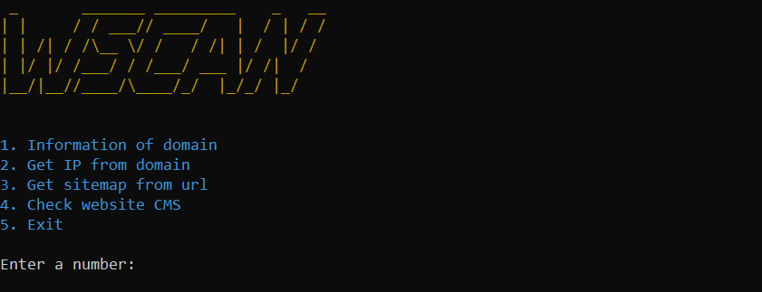

# WSCAN
## _Web Scanner_

WSCAN will help you get information about any website or domain, even about the CMS it uses!

## Features

- Information of domain
- Get IP of domain
- Get sitemap from url
- Check website CMS

WSCAN currently only detects WordPress and Joomla, but will soon detect many more.

## Installation

WSCAN requiere Python 3

```sh
git clone https://github.com/alexfs2015/WSCAN
cd WSCAN
pip install -r requirements.txt
python main.py
```

## Usage
The use of WSCAN is very simple, when you start WSCAN you will see a menu like this one:

And there you will be able to use the option you prefer.

Any suggestions or ideas are welcome!

## License

MIT
